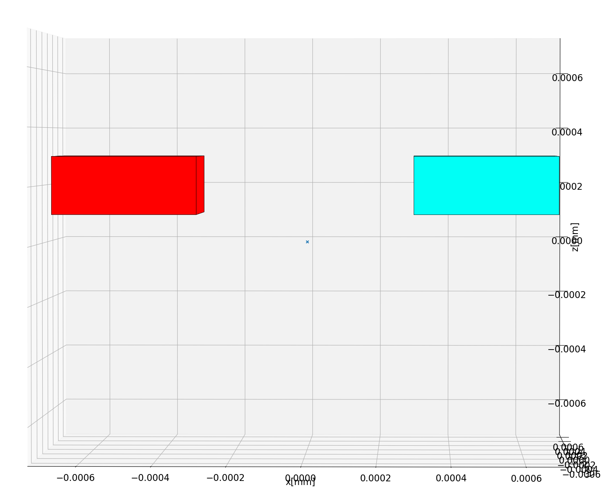
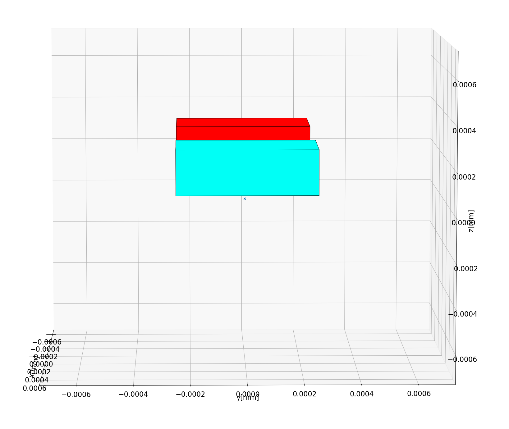

Introduction to micromagnet design
===================================

This section will talk about how to generate different magnet geometries. As coordinate system, the standard Cartesian system is used. The magnetization of the magnets can be set in arbitrary direction, so there is no standard direction for fields. Standard units are chosen to be, magnetic field in Tesla and distances in nm.

All starts with making a call to the library, e.g. , 
```python
from micromagnet_simulator.magnet_creator import umag_creator

umag = umag_creator()
```
This will generate an object that manages the creation of different blocks of magnets.

Next you can set the general properties that will be used throughout the simulations, 
```python
# set magnetization in the x,y,z direction with a field strength of 1,0,0 Tesla.
umag.set_magnetisation(1,0,0)
# set external field, 150mT along the x-direction
umag.set_external_field(0.150,0,0)
```

In the simulation, you can also specify the location of the spin qubits (optional), this will allow you later on to sweep properties of the micromagnet and check how this effects the qubits,
```python
# specification of the locations : (x,y,z) axis, (0nm,-200nm, -30nm) 
umag.add_electron_position(0, -200, -30)
umag.add_electron_position(0, -120, -30)
umag.add_electron_position(0,  -40, -30)
umag.add_electron_position(0,   40, -30)
umag.add_electron_position(0,  120, -30)
umag.add_electron_position(0,  200, -30)
```

Now all the side information is specified, let's generate the magnets.

The most simple element to add is a cube:
```python
# syntax : center_x, center_y, center_z, span_x, span_y, span_z
umag.add_cube(-500, 0, 200, 400,500,200)
umag.add_cube( 500, 0, 200, 400,500,200)
```
This code will add two pieces of micromagnet in the space, the result can be inspected with:
```python
view = umag.generate_view(True)
view.show()
```

The resulting code produces a slab of magnets like this : 
A example window would look like:

xz view                    |  yz view
:-------------------------:|:-------------------------:
  | 


It is also possible to add triangular pieces of micromagnet. In this example a slanted area at the edge will be added.
```python
umag = umag_creator()

umag.add_cube(-500, 0, 200, 400,500,200)
# in this case we specify the coordinates of a triangle in the xz plane
p_2 = (-450, 0, 100)
p_1 = (-500, 0, 100)
p_3 = (-500, 0, 300)
# now we can extend in the y plane around these coordinate (so in this case, -250nm, 250nm on the y axis)
umag.add_triangle(*p_1, *p_2, *p_3, 'y',500, n_magnets=20)
view = umag.generate_view(True)
view.show()
```
The result : 

