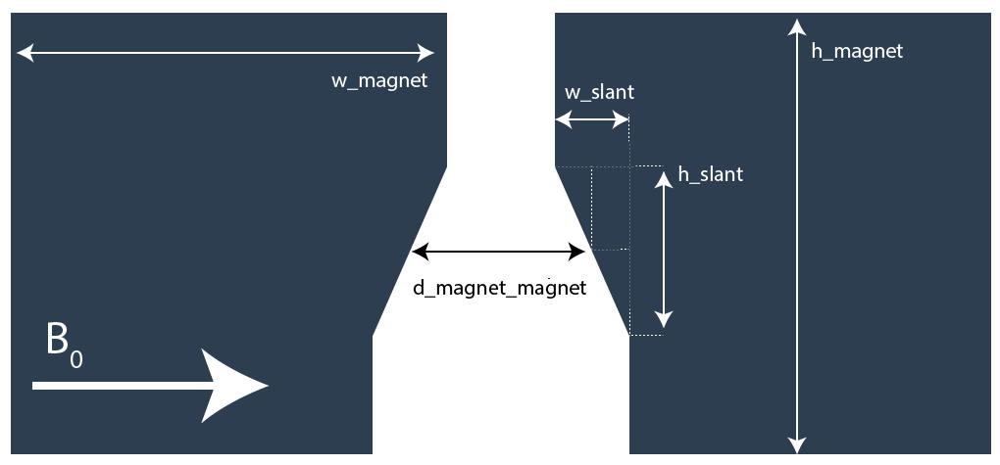
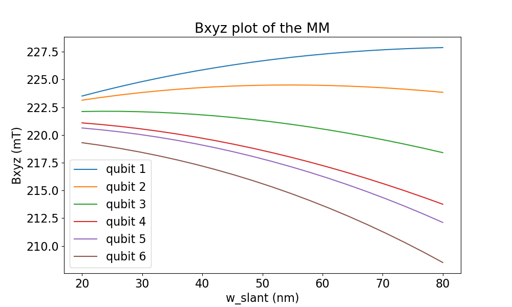
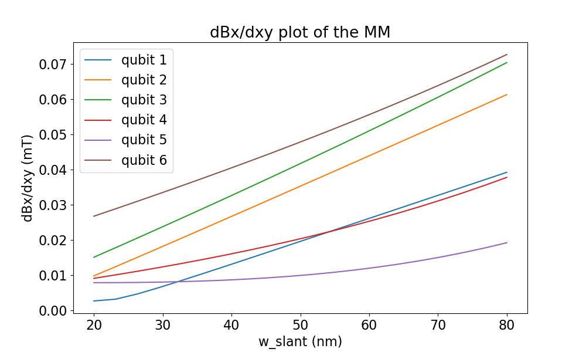
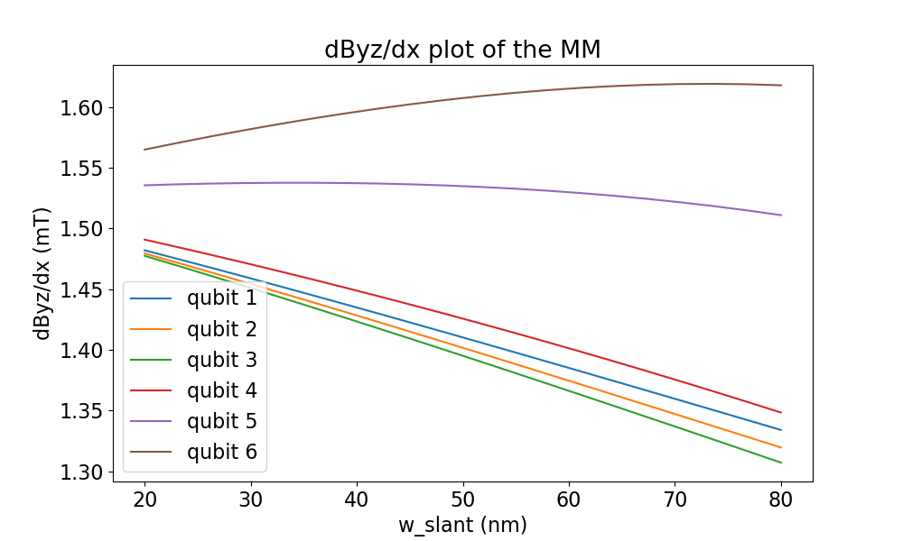
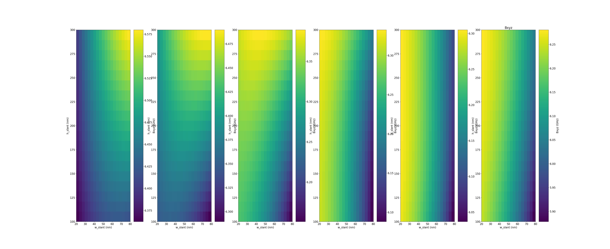
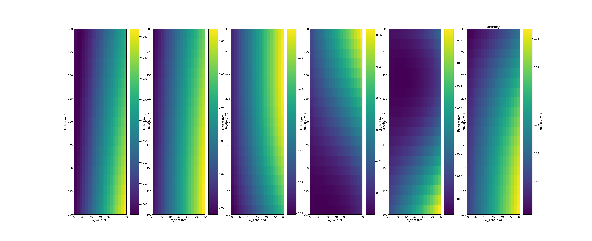
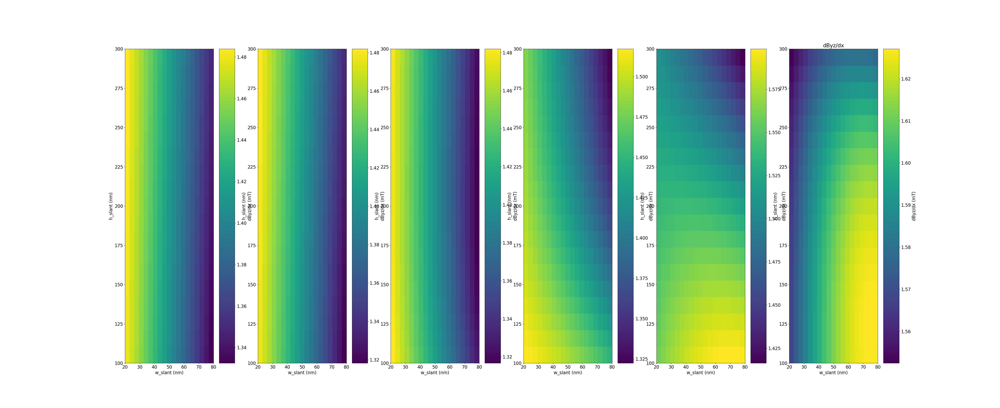

Sweeping variables and inspecting fields
========================================

To optimize micromagnet designs it is possible to sweep one or two variables in the simulation. For each point in this sweep properties at the locations of the pre-defined qubit can be inspected. As an example, the following micromagnet design will be used : 

Let's start by making a function that generaties this design:

.. code-block:: python

	from micromagnet_simulator.magnet_creator import umag_creator

	def example_MM_design(d_magnet_magnet, h_slant, w_slant, h_2deg=70, h_magnet=200):
		w_magnet = 5000
		h_magnet = 2000

		umag = umag_creator()
		umag.set_magnetisation(1,0,0)

		umag.add_electron_position(0, -200, -30)
		umag.add_electron_position(0, -120, -30)
		umag.add_electron_position(0,  -40, -30)
		umag.add_electron_position(0,   40, -30)
		umag.add_electron_position(0,  120, -30)
		umag.add_electron_position(0,  200, -30)

		# the big slabs
		umag.add_cube(-w_magnet/2-d_magnet_magnet/2-w_slant/2, 0, h_2deg+h_magnet/2,
			w_magnet,h_magnet,h_magnet)
		umag.add_cube( w_magnet/2+d_magnet_magnet/2+w_slant/2, 0, h_2deg+h_magnet/2,
			w_magnet,h_magnet,h_magnet)

		# the small pieces above the rectangle
		umag.add_cube(-d_magnet_magnet/2, h_magnet/4+h_slant/4, h_2deg+h_magnet/2,
			w_slant,h_magnet/2-h_slant/2,h_magnet)
		umag.add_cube( d_magnet_magnet/2, h_magnet/4+h_slant/4, h_2deg+h_magnet/2,
			w_slant,h_magnet/2-h_slant/2,h_magnet)

		# the rectangular pieces.
		p_2 = (-d_magnet_magnet/2-w_slant/2, -h_slant/2, h_2deg+h_magnet/2)
		p_1 = (-d_magnet_magnet/2-w_slant/2,  h_slant/2, h_2deg+h_magnet/2)
		p_3 = (-d_magnet_magnet/2+w_slant/2,  h_slant/2, h_2deg+h_magnet/2)
		umag.add_triangle(*p_1, *p_2, *p_3, 'z',200, n_magnets=10)

		p_2 = (d_magnet_magnet/2+w_slant/2, -h_slant/2, h_2deg+h_magnet/2)
		p_1 = (d_magnet_magnet/2+w_slant/2,  h_slant/2, h_2deg+h_magnet/2)
		p_3 = (d_magnet_magnet/2-w_slant/2,  h_slant/2, h_2deg+h_magnet/2)
		umag.add_triangle(*p_1, *p_2, *p_3, 'z',200, n_magnets=10)

		return umag

Now the question is how to sweep things? To do this, a concept similar to numpy arrays is introduced, sweeps can be defined by providing arrays to the simulation. To do this, you will need to use a linspace object. For example:

.. code-block:: python

	from micromagnet_simulator.looping import linspace

	# make a linspace object like numpy does, axis, name and units
	# are given to give the solver information how the sweep should be executed
	w_slant =  linspace(20, 80,20, axis=0, name='w_slant', unit='nm')

1D-sweeps
---------
Below an example of how to do 1D sweeps is shown, using the code defined before.

.. code-block:: python

	w_slant =  linspace(20, 80,20, axis=0, name='w_slant', unit='nm')

	umag = example_MM_design(250, 200, w_slant)
	view = umag.generate_qubit_prop()

	view.unit = 'GHz'
	view.plot_fields('xyz')

	view.unit = 'mT'
	view.plot_derivative('x', movement_direction='xy')
	view.plot_derivative('yz', movement_direction='x')
	view.show()

This code gives rise to the following plots :

+-------------------+-------------------+-------------------+
| Total field       | Driving field     | Decoherence field |
+===================+===================+===================+
| |totfield1D|      | |vecfield1D|      | |drifield1D|      |
+-------------------+-------------------+-------------------+

2D-sweeps
---------

Example:

.. code-block:: python

	w_slant =  linspace(20, 80,20, axis=0, name='w_slant', unit='nm')
	h_slant =  linspace(100, 300,20, axis=1, name='h_slant', unit='nm')

	umag = example_MM_design(250, h_slant, w_slant)
	view = umag.generate_qubit_prop()

	view.unit = 'GHz'
	view.plot_fields('xyz')

	view.unit = 'mT'
	view.plot_derivative('x', movement_direction='xy')
	view.plot_derivative('yz', movement_direction='x')

	view.show()

Results:

+-------------------+-------------------+-------------------+
| Total field       | Driving field     | Decoherence field |
+===================+===================+===================+
| |totfield2D|      | |vecfield2D|      | |drifield2D|      |
+-------------------+-------------------+-------------------+
