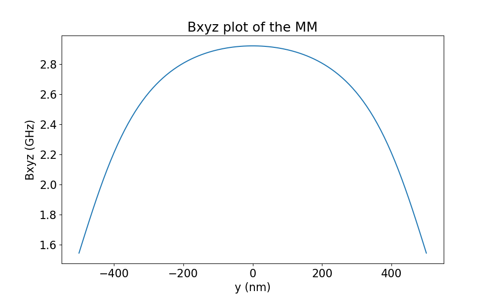
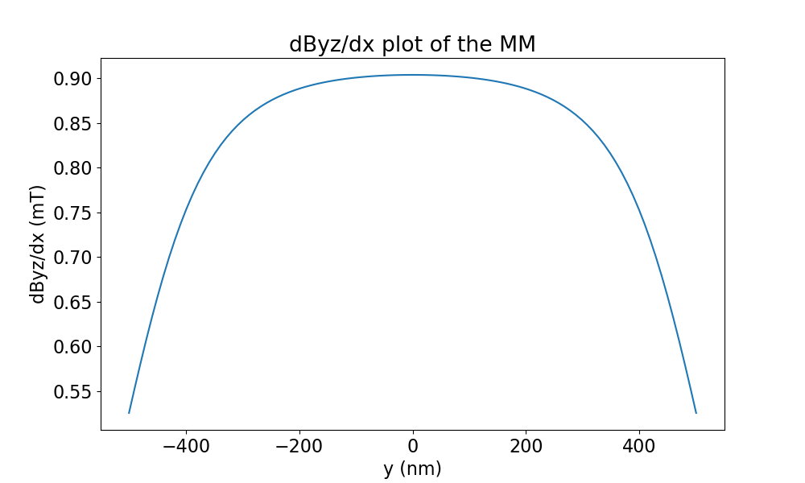
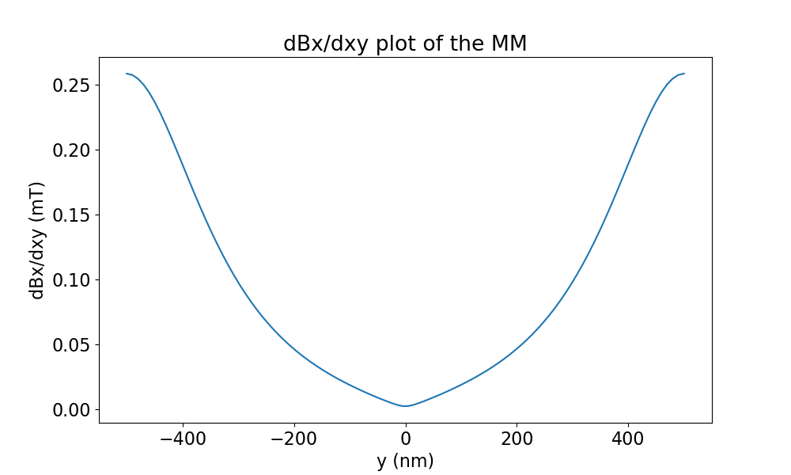
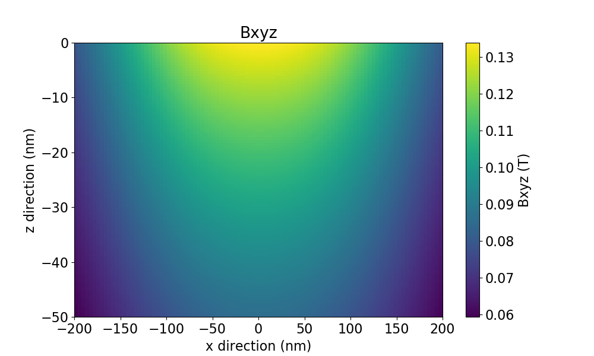
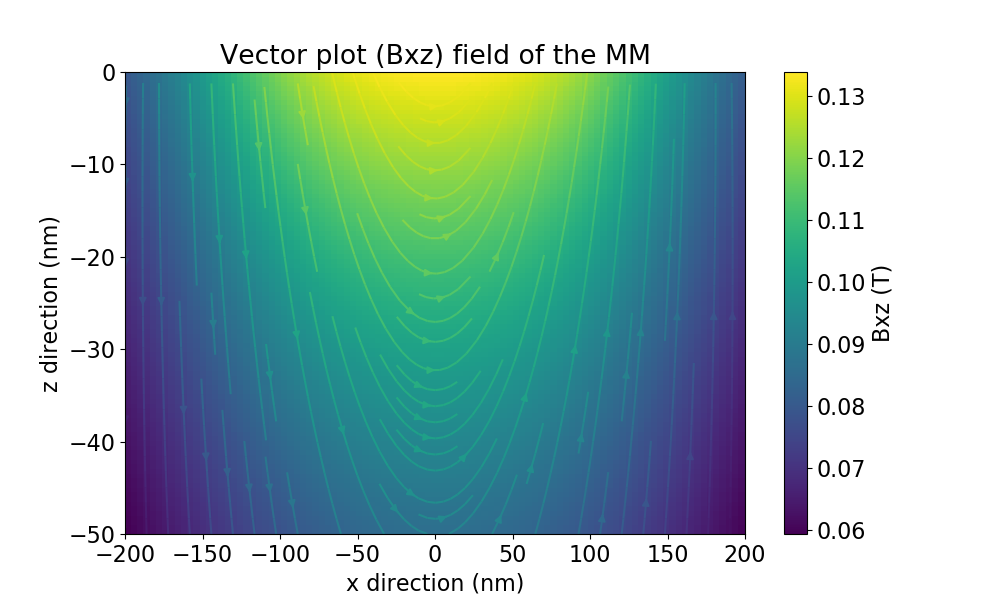
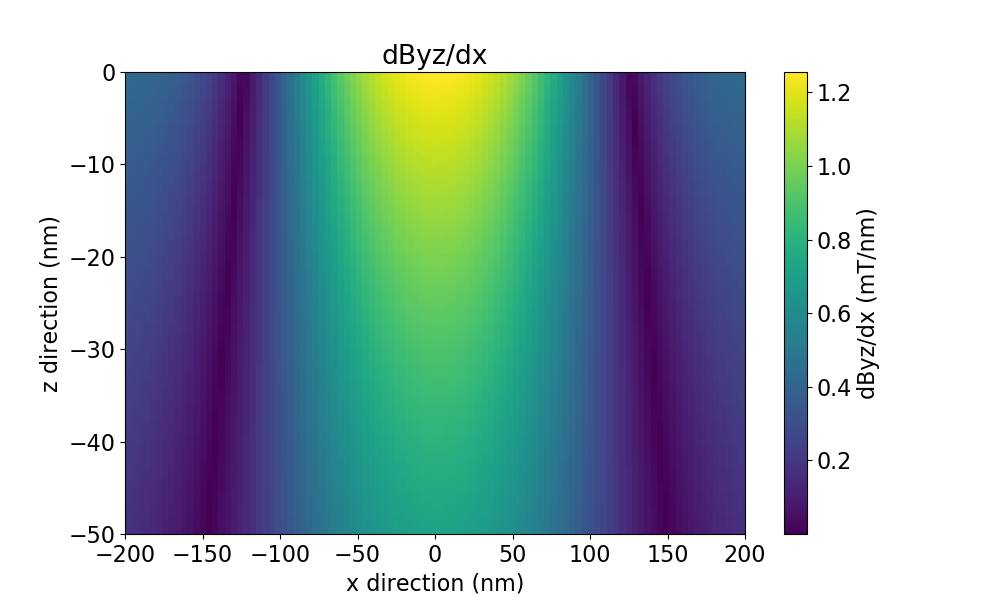
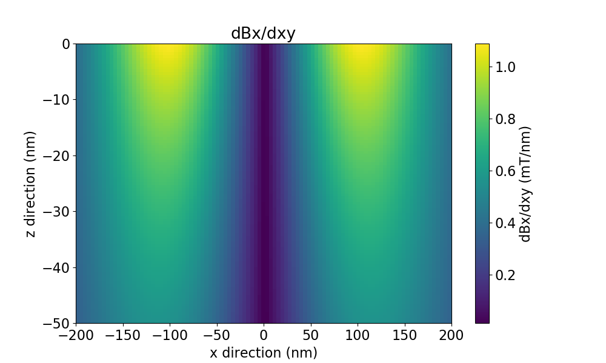

Inspecting the field generated by the micromagnet
=================================================

Once the geometry of the micromagnet is specified, the field of the micromagnet can be calculated, this can be done by making a view. For this example, we will generate two slabs of micromagnet and inspect the fields at the location of the qubits.

```python
umag = umag_creator()

umag.add_cube(-2000, 0, 200, 3800,1000,200)
umag.add_cube( 2000, 0, 200, 3800,1000,200)

view = umag.generate_view()
```
The ```generate_view()``` method will generate a view of the currently specified micromagnet design. Now the result of the simulation can be plotted, before doing this, we will have the specify the area to plot : 
```python
# a 1D slice of the field at the locations of the qubits
view.set_slice('y', -500, 500, 100, 0, -30) # plot y-axis, -500nm to 500nm (100pt), x=0, z=-30

# a 2d image in the xz plane, x : -200nm, 200nm, 100 points, z : -100nm, 300nm, 100 points ; y : 0nm
view.set_image('xz', -200,200,100,-100,300,100, 0)
```
The unit used in the plots can be set/modified by calling (default Tesla) :
```python
# available units are 'T', 'mT', 'MHz' and 'GHz'
view.unit = 'mT'
```

Example of a 1D plot
--------------------

Let's make some plots of the fields along the y axis. In this case we are interested in seeing:
* The total field applied (field in x,y,z can also be simulated separately)
* The driving gradient of the qubits, this is the derivative of field components perpendicular on the main component of the field versus the movement direction for driving. In this case, the quantization axis is in the x direction, so field in the y and z direction can drive the qubit. We will assume the drive is applied by moving the qubit in the x direction.
* The decoherence gradient is determined by change of the field along the quantization axis (x) with respect to movement of the qubit due to noise (here free movement in the xy plane).

```python
view.set_slice('y', -1000, 1000, 500, 0,-30) 

view.unit = 'GHz'
fig_abs_field = view.plot_fields('xyz') #specified which field direction, for Bx, specify 'x'

view.unit = 'mT'
fig_driving_gradient = view.plot_derivative(field_direction='yz', movement_direction='x' )
fig_dec_gradient     = view.plot_derivative(field_direction='x' , movement_direction='xy')

view.show()
```

The generated plots look like this:
Total field                |  Driving gradient		  |  Decoherence gradient
:-------------------------:|:------------------------:|:-------------------------:
  | | 


Example of a 2D plot
--------------------
This is very similar to the plots options of the 1D plots, an example:

```python
view.set_image('xz', -200,200,100,-100,300,100, 0)

view.unit = 'T'
fig_abs_field = view.plot_fields('xyz') #specified which field direction, for Bx, specify 'x'
fig_vec       = view.plot_fields('xz', plot_type='vect') #make a vector plot

view.unit = 'mT'
fig_driving_gradient = view.plot_derivative(field_direction='yz', movement_direction='x' )
fig_dec_gradient     = view.plot_derivative(field_direction='x' , movement_direction='xy')

view.show()
```

The generated plots look like this:
Total field                |  Vector image 			  |
:-------------------------:|:------------------------:|
  | |
Driving gradient           |  Decoherence gradient	  |
  | |